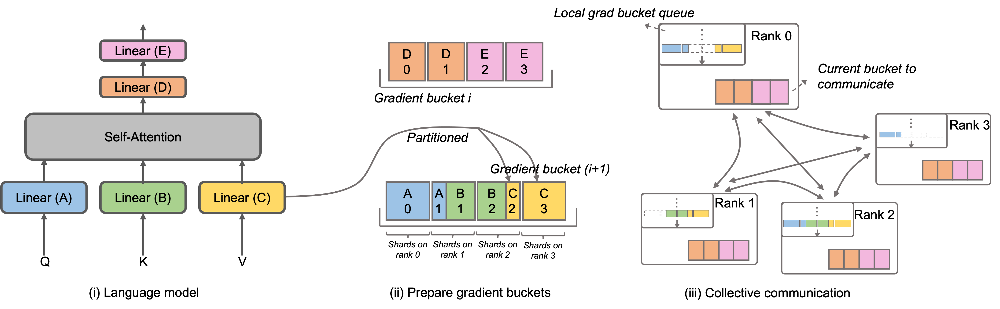
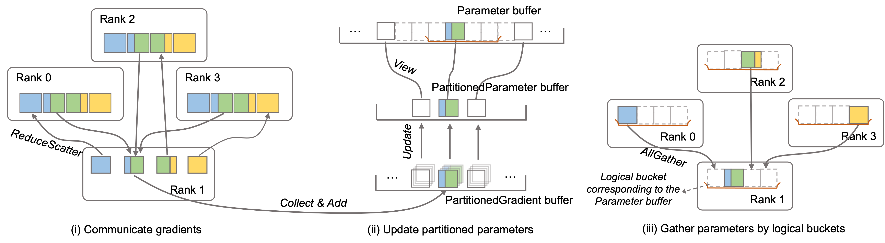

# Megatron-LLaMA: 让你更快的训练你的LLaMA

## 1. 概述

LLaMA是目前大语言模型开源社区中一项重要工作。LLaMA在LLM的结构中引入了BPE字符编码、RoPE位置编码、SwiGLU激活函数、RMSNorm正则化以及Untied Embedding等优化技术，在许多客观和主观评测中取得了卓越的效果。LLaMA提供了7B、13B、30B、65B/70B的版本，适用于各类大模型需求的场景。在开源社区中，已有非常多的成功的变种，包括基于LLaMA进行续训/SFT（如Alpaca、Vicuna、WizardLM、Platypus、Minotaur、Orca、OpenBuddy、Linly、Ziya等）和参考LLaMA的从零开始训练（Baichuan、QWen、InternLM、OpenLLaMA）的工作。更进一步，这些工作展现了在长文本理解、长文本生成、代码编写、数学求解、工具使用等方面的卓越能力。

然而，训练或SFT一个自己的LLaMA往往需要昂贵的算力成本，很大程度阻碍了开发者尝试自己的设计。通常，开发者们会使用较大显存的GPU或是多GPU机型组成的分布式集群进行大语言模型的训练。Megatron-LM是一种结合张量并行（TP, Tensor Parallel）、流水线并行（PP, Pipeline Parallel）、序列并行（SP, Sequence Parallel）的分布式训练解决方案。训练参数规模在百亿级别的模型时，能够达到远超LLaMA 公开版本（基于Huggingface以及DeepSpeed实现）的硬件利用率。但同时，原生Megatron-LM在超大规模训练时，存在分布式优化器通信占比过高的问题。

因此，为了回馈整个LLaMA开源社区，让开发者们能够更方便地提升大语言模型的训练性能，降低训练成本，阿里巴巴将部分内部优化技术开源，发布了Megatron-LLaMA。Megatron-LLaMA具备以下特点：

(i) **基于Megatron-LM实现的标准LLaMA模型**：目前开发者们获得LLaMA代码通常来自于Huggingface，无法使用Megatron-LM中所提供的各类并行方法。Megatron-LLaMA提供了一套标准的LLaMA的Megatron-LM实现，开发者可以根据实际情况选择配置。我们后续将陆续发布对Alibi、FlashAttention2等技术的支持。

(ii) **高效的通信-计算并行**：Megatron-LM 中[`DistributedOptimizer`](https://github.com/NVIDIA/Megatron-LM#distributed-optimizer)实现了类似于[DeepSpeed ZeRO Stage 2](https://www.microsoft.com/en-us/research/blog/zero-2-deepspeed-shattering-barriers-of-deep-learning-speed-scale/)的梯度和优化器状态切分技术，从而显著降低了显存占用。然而，Megatron-LM提供的方案并未充分利用GPU计算和通信可以并行的特性，导致硬件资源没有充分利用。Megatron-LLaMA在原`DistributedOptimizer` 以及`ZeRO2` 的基础上，提出了全新的梯度及优化器状态切分方式，在不牺牲精度的同时实现了：a) 极高的通信与计算并行执行比例；b) 极高的通信带宽利用率；c) 更低的显存占用。借此实现在相同的硬件上获得更高的训练吞吐。

(iii) **完善的框架支持**：Megatron-LLaMA对Megatron-LM原有的存取checkpoint相关的逻辑进行了调整，包括：a) Checkpoint的分布式多rank存取，提升读写速度。提供了文件系统的接口抽象，便于结合[HDFS](https://hadoop.apache.org/docs/r1.2.1/hdfs_design.html)等分布式文件系统进行存取；b) 便捷的与HuggingFace支持的权重格式转换的接口，方便训练完成后下游任务的使用。c) 支持使用HuggingFace格式的[Tokenizer](https://huggingface.co/docs/transformers/main/model_doc/llama#transformers.LlamaTokenizer)。

**Megatron-LLaMA使得大规模训练LLaMA模型更加快速、经济并且易于向更大规模扩展。**

**高效性和经济性**: 使用Megatron-LM中的并行技术训练LLaMA可以更快速且经济实惠。例如，在四台8xA100-80GB（with NVLink）上续训练一个自己的LLaMA-13b模型。对比使用DeepSpeed ZeRO2的HuggingFace版本；与使用`DistributedOptimizer`的Megatron-LLaMA版本。消费10B数据时，Megatron-LLaMA相比高度优化的HuggingFace LLaMA版本可以节约9.4小时（以阿里云灵骏智算服务价格折算，节约8804人民币）。

|  | DeepSpeed (HF) | Megatron-LLaMA |
| ------ | ------ | ------ |
| Training cost | 49.7 hours (¥46548) | 40.3 hours (¥37744) |
| Training Model TFLOPS | 146 |180 |

**通过梯度聚合，总Batch Size设置为2048*

**HF/DeepSpeed 实现适配了[FlashAttention](https://arxiv.org/abs/2205.14135)*

**卓越的扩展性**: Megatron-LLaMA具备良好的扩展性。为保证训练后的模型效果，通常总Batch Size需要被预先确定。例如在LLaMA的论文中，训练时使用的总Batch Size为4M个Token。在超大规模训练中，因数据并行较大，为保证总Batch Size不变，无法使用较高的梯度聚合，导致`DistributedOptimizer`通信占比过高。Megatron-LLaMA得益于`OverlappedDistributedOptimizer`极佳的通信与计算并行能力，能够几乎不受无法使用梯度聚合的影响，在超大规模训练时，提供更高的训练吞吐。下面的表格列出了复现LLaMA-13B的训练时（使用灵骏智算提供的8xA100-80G显卡，机间互联为4x200Gbps RDMA网络），每张GPU上观测到的每秒消费的Token数量（Token/GPU/sec）。以此指标计算，从32卡扩展到512卡，Megatron-LLaMA的扩展比可以达到0.85，而Megatron-LM只能有0.7左右。

|  | 256xA100 80GB | 512xA100 80GB |
| ------ | ------ | ------ |
| Megatron-LLaMA with OverlappedDistributedOptimizer | 1800 (25.1 days) | 1660 (13.6 days) |
| Megatron-LLaMA with DistributedOptimizer| 1630 (27.8 days) | 1430 (15.8 days) |

## 2. Megatron-LLaMA中`OverlappedDistributedOptimizer`简介

在原生Megatron-LM中，用户可以使用[`DistributedOptimizer`](https://github.com/NVIDIA/Megatron-LM/blob/main/docs/distrib_optimizer.md)来切分梯度和优化器状态，以减少训练中的显存占用。`DistributedOptimizer`在每次获得预设的梯度聚合组梯度后，通过`ReduceScatter`算子，将之前累积的全部梯度分发到不同的Rank。每个Rank更新完属于自己的参数后，再通过`AllGather`算子将更新后的参数复制到所有Rank。在实际训练中，我们观察到`DistributedOptimizer`的集合通信在梯度聚合较小的情况下，将引入极大的额外开销。极端情况下，不使用梯度聚合，将引入超过整体耗时50%的额外开销。

在尝试实现通信和计算并行的过程中，我们尝试了DeepSpeed ZeRO2中对梯度以及优化器状态的切分方式。在超大规模的场景下，我们观察到其切分方式需要大量细碎的通信Kernel，无法充分利用通信带宽，造成了通信耗时过长，模型的计算量不足以与通信充分并行。

我们将该问题抽象为以下两个部分：

1. 发掘逻辑上通信与计算并行的空间
2. 探索不同切分方式，在保持最低通信数据量的同时，充分利用通信与计算并行的空间以及硬件的通信带宽

于是，我们设计了全新的梯度及优化器状态切分方式。这里列出新切分方式的核心思想：

1. 常见优化器（如Adam，SGD）在更新参数时，参数中每个数值的更新都是独立的。因此在设计切分方式时，无需考虑每个Rank负责的参数是否完整，且无需在顺序上与模型保持一致。
2. 新的切分方式需要实现：a) 单一集合通信算子数据量足够大，充分利用通信带宽；b) 新切分方式所需通信数据量应等于数据并行所需的最小通信数据量；c) 完整参数或梯度与切分后的参数或梯度的转化过程中，不能引入过多显存拷贝


<center>图1. Megatron-LLaMA中的Gradient bucket</center>

如图1，在`OverlappedDistributedOptimizer`初始化时，会预先给所有参数分配其所属的`Bucket`。`Bucket`中的参数是完整的，一个参数仅属于一个`Bucket`，一个`Bucket`中可能有多个参数。逻辑上，每个`Bucket`将会被连续等分成P（P为数据并行组的数量）等份，数据并行组中的每个Rank负责其中的一份。`Bucket`被放置在一个本地队列（Local grad bucket queue）中，从而保证通信顺序。在训练计算的同时，数据并行组间，以`Bucket`为单位，通过集合通讯交换各自需要的梯度。


<center>图2. Megatron-LLaMA中的通信机制设计</center>

Megatron-LLaMA设计了一套高效的通信机制。该机制在`OverlappedDistributedOptimizer`初始化阶段，创建一个大小等于当前Rank所负责的所有参数的大小之和的空间（`PartitionedParameter buffer`)，用于记录当前Rank优化器需要更新的参数，并从分片前的模型参数中取出当前Rank负责的参数分片，赋值至`PartitionedParameter buffer`。同时创建一个大小与`PartitionedParameter buffer`相同的空间（`PartitionedGradient buffer`），用于存放`PartitionedParameter buffer`对应的梯度。于是，Megatron-LLaMA的通信机制主要分为下面三个步骤：

a) 如图2-i，在反向计算过程中，当一个参数获得其对应的梯度后，会将其梯度拷贝至`Bucket`中的对应位置。当一个`Bucket`中所有参数的梯度都完成拷贝后，即可通过一个完整的`ReduceScatter`将该`Bucket`中所有收集到的梯度，求和、切分并赋值至`PartitionedGradient`中对应位置。

b) 如图2-ii，当所有`Bucket`完成`ReduceScatter`后，即可使用`PartitionedParameter buffer`和`PartitionedGradient buffer`更新切分后的参数。

c) 如图2-iii，更新完`PartitionedParameter buffer`后，`PartitionedParameter buffer`中的参数将以`Bucket`为单位，通过`AllGather`恢复出完整的更新后的参数。

在此基础之上，我们通过以下方式优化显存占用，减少显存拷贝：

1. 在`OverlappedDistributedOptimizer`初始化阶段，将会开辟出一个与所有参数大小总和相同的空间（`ParameterBuffer`），并将所有模型参数的实际存储放在`ParameterBuffer`中。在`AllGather`更新后参数时，可以直接将目的地址指定为`ParameterBuffer`中的对应位置。从而避免使用临时空间，并减少显存拷贝。（该优化借鉴了DeepSpeed）
2. 在参数获得梯度后，向`Bucket`中拷贝时。一旦完成拷贝，原梯度即可释放，降低显存占用。同时用于暂存梯度的`buffer`在`ReduceScatter`后即可释放，降低显存占用。在此基础之上，我们引入了Buffer轮换机制，从而避免频繁申请以及释放显存带来的碎片问题。

## 3. 使用方法

Megatron-LLaMA使用方式与Megatron-LM基本一致，详细信息请参考[Megatron-LM Usage](./original_README.md#contents)

在此基础上，我们提供了：

### A. 模型权重转换工具

使用该工具可在HuggingFace与Megatron-LM支持的模型权重间自由转换。

例如，用户可将从[HuggingFace LLaMA](https://huggingface.co/docs/transformers/main/model_doc/llama)获取的预训练模型权重转换为可在Megatron-LLaMA中使用的格式，进行微调：

**HuggingFace to Megatron-LLaMA**

```
sh tools/checkpoint_conversion/hf_to_megatron.sh
```

完成训练后，将训练产出的权重转换成HuggingFace支持的格式，方便后续使用：

**Megatron-LLaMA to HuggingFace**

```
sh tools/checkpoint_conversion/megatron_to_hf.sh
```

### B. LLaMA训练脚本

**单机启动**

```
sh examples/LLaMA/LLaMA_13_standalone.sh
```

**分布式启动**

可根据实际使用的调度器，修改单机启动脚本。例如：

```
sh examples/LLaMA/LLaMA_13_slurm.sh
```

特别地，应尽可能使用更大的MicroBatchSize，以提升硬件利用率。

**Megatron-LLaMA特殊参数说明**

| 参数名 | 作用说明 |
| ------ | ------ |
| `--overlapped-distributed-optimizer` | 启用Megatron-LLaMA中的`OverlappedDistributedOptimizer`。不能与`--use-distributed-optimizer`同时使用。 |
| `--reduce-bucket-size` | 用于设置`OverlappedDistributedOptimizer`使用的`Bucket`大小。默认值为5e8，可根据实际模型大小以及网络情况修改。通常更大的`Bucket`意味着更高的通信带宽利用率；更小的`Bucket`意味着更多通信与计算并行的可能性。 |
| `--tokenizer-type=PretrainedFromHF` | 在原有`--tokenizer-type`上增加了对[HuggingFace Tokenizer](https://huggingface.co/docs/transformers/main_classes/tokenizer#tokenizer)的支持。 |
| `--distributed-checkpointing` | 分布式多rank同时读写Checkpoint。可配合分布式存储使用。 |


## 4. 使用说明

本项目由阿里巴巴爱橙科技发布及提供后续支持。欢迎大家尝试、交流、提出建议，让训练LLaMA更加简单、快速、经济。

### 未来计划

* 我们将陆续开源对30B和65B/70B模型的最佳训练配置和解决方案
* 我们将陆续开源对Alibi（包括精度优化）和FlashAttention2等模型实现相关的支持
* 我们将陆续完善对其他开源模型的加速训练支持


### License

Megatron-LLaMA使用Apache 2.0开源协议，允许用作商业用途。详情请参阅LICENSE文件。

### 参考工作

[Megatron-LM](https://github.com/NVIDIA/Megatron-LM)

[LLaMA](https://github.com/facebookresearch/llama)

[DeepSpeed](https://github.com/microsoft/DeepSpeed)
